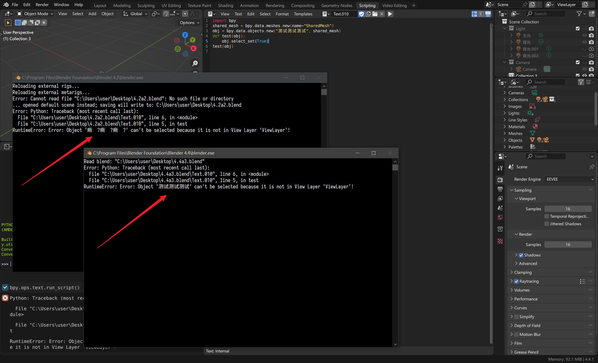

# Blender插件 控制台UTF8编码修复工具
启动Blender时自动将Console控制台设置为UTF-8编码，解决中文显示乱码问题

# 使用方法
安装插件后将插件启用即可，每次运行Blender都会自动将控制台改为UTF8

# 测试方法
激活插件后在Blender运行脚本，主动触发报错，观察中文是否乱码
```
import bpy
shared_mesh = bpy.data.meshes.new(name="SharedMesh")
obj = bpy.data.objects.new("测试测试测试", shared_mesh)
def test(obj):
    obj.select_set(True)
test(obj)
```

